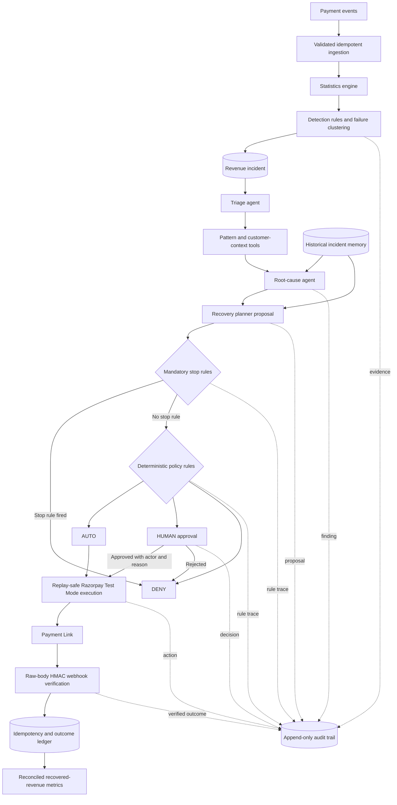

# Sentinel architecture

Sentinel separates model-assisted investigation from deterministic financial authority. PostgreSQL is the system of record; every consequential decision is explainable through persisted evidence and the append-only audit trail.

## Runtime boundaries

- **Spring Boot / Java 17:** orchestration, rules, external gateways, evaluation, and APIs.
- **PostgreSQL / Flyway:** durable state, uniqueness guards, migrations, audit, and outcome reconciliation.
- **Next.js / TypeScript:** an operational read-and-command surface; no provider secrets or raw webhook bodies enter the browser.
- **Gemini:** structured diagnosis support behind `LlmClient` and `EmbeddingClient`; investigation has a bounded deterministic fallback.
- **Razorpay Test Mode:** the only execution target; policy or persisted human approval must grant permission first.

See [SETUP.md](SETUP.md) for the one-command runtime and [evaluation/README.md](evaluation/README.md) for the reproducible proof contract.
