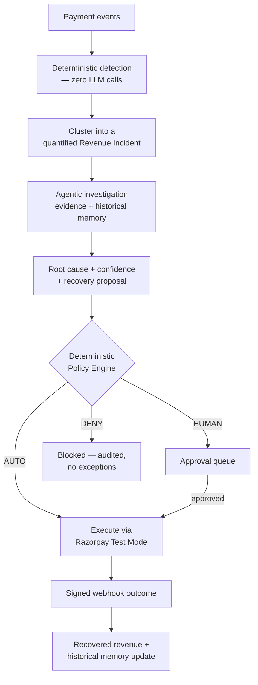

<div align="center">


# Sentinel

**A governed multi-agent revenue-recovery platform with deterministic financial guardrails.**

[](https://github.com/sufibuildwith-py/Sentinel/actions/workflows/phase9-proof.yml)


-brightgreen)


Built for the **Razorpay AI Revenue Recovery** track — Java 17 · Spring Boot 3 · PostgreSQL · Next.js

[Watch the 90-second demo](#see-it-work) · [Read the proof](#the-proof-phase-9) · [Run it yourself](#run-it-in-one-command) · [Full architecture](ARCHITECTURE.md)

</div>

---

## The pitch

When a payment fails at scale — a bank's UPI degrading, a provider outage, a spike in one failure code — real revenue is lost. Most "AI revenue recovery" demos are a chatbot that reads the failure and guesses a fix. **Sentinel doesn't let an AI touch money on a guess.**

> **AI proposes. Evidence supports. Policy decides. Tools execute. Outcomes teach.**

Every recovery Sentinel attempts passes through a **separate, fully deterministic policy engine** — no AI, no ambiguity — that returns `AUTO`, `HUMAN`, or `DENY`. An already-paid payment is denied even when the AI's confidence is high. Nothing is executed without a persisted, auditable reason.

### The headline numbers

| Proof | Result |
|---|---|
| Deterministic evaluation scenarios | **464**, across 29 categories, fixed seed |
| Policy compliance against the labelled oracle | **432 / 432 (100%)** |
| Execution-eligibility compliance | **464 / 464 (100%)** |
| Unsafe autonomous executions | **0** |
| Duplicate financial effects | **0** |
| Invalid webhook signatures accepted | **0** |
| Approval-gate bypasses | **0** |
| Zero-tolerance safety gates passed | **8 / 8** |

These are **deterministic evaluation results, not production revenue claims** — regenerable on demand from the checked-in harness. See [what this proves and doesn't prove](#the-proof-phase-9).

---

## See it work

> 🎥 *Demo recording goes here* — a 60–90 second capture of: injecting the UPI-outage scenario → investigation producing a root cause with evidence → the policy trace showing an `AUTO`/`HUMAN` decision → execution creating a real Razorpay Test Mode Payment Link → the webhook landing and recovered revenue updating live on the dashboard.
>
> The strongest single shot to include: filtering the evaluation dashboard for **`already paid`** and showing a **DENY** at high AI confidence — that's the moment that proves the guardrail is real.

The full demo script, screen-by-screen, is in [SETUP.md](SETUP.md).

---

## Why this is different from an AI wrapper

- **The AI never has execution authority.** It proposes a root cause and a recovery strategy — evidence-backed, schema-validated, with a confidence score. It cannot spend a rupee. A separate rules engine decides that, every time, with zero exceptions.
- **Every safety claim is proven, not asserted.** A 464-scenario deterministic harness re-runs the real detection, policy, and webhook-verification code against an independent expected oracle on every build. If a change breaks a guarantee, CI fails — it doesn't ship silently.
- **It fails safely, not silently.** Gemini down? Investigation still completes with a deterministic, lower-confidence finding. Razorpay slow? Bounded retries and reconciliation, never a blind retry that could double-create a resource.

---

## The loop



Full system architecture, package structure, and data model: **[ARCHITECTURE.md](ARCHITECTURE.md)**.

---

## Run it in one command

```bash
git clone <this-repo>
cd sentinel
cp .env.example .env   # add your Gemini key; Razorpay Test Mode keys optional
docker compose up --build
```

That starts PostgreSQL, runs all Flyway migrations, health-checks the backend, and serves the dashboard at `localhost:3000`. Full nine-step setup and demo walkthrough: **[SETUP.md](SETUP.md)**.

---

## The proof (Phase 9)

Sentinel ships with a **deterministic evaluation harness**, not just a test suite — it exists specifically to prove the safety claims above are true, reproducibly, on every build.

- **464 labelled scenarios**, 29 categories, fixed seed `20260901` — same seed, byte-identical report, every time.
- Every scenario runs through the **real** `DetectionRuleEngine`, `PolicyEngine`, and webhook HMAC verifier — nothing mocked at the decision layer.
- **8 zero-tolerance gates** where a single failure fails CI: unsafe autonomous execution, duplicate financial effects, accepted invalid signatures, reversed paid outcomes, policy disagreement, approval bypass, sensitive-data leakage, same-seed drift.
- Full metric definitions, confusion matrix, and the honest **"what this does and doesn't prove"** statement: **[evaluation/README.md](evaluation/README.md)**.
- Live proof endpoints: `GET /api/v1/evaluation/report` · `POST /api/v1/evaluation/run` · dashboard at `/evaluation`.

**What this doesn't prove:** production payment-success uplift, real merchant recovery rate, or workload capacity. Every money figure anywhere in this project is explicitly labelled **Test Mode / Synthetic Evaluation**.

---

## Tech stack

Java 17 · Spring Boot 3.3 · PostgreSQL 16 · Flyway · Spring Data JPA · Easy Rules (policy + detection) · Resilience4j (circuit breakers) · Apache Commons Math (statistics) · Google Gemini (structured, schema-validated reasoning only) · Next.js + TypeScript (dashboard) · Testcontainers (real-Postgres testing, no H2 substitution) · Docker Compose

---

## Deliberate non-goals

No fifteen-agent swarm. No Kubernetes. No Kafka without a demonstrated need. No custom ML anomaly model before the deterministic rules earned it. No real-money automation, ever. Deep and bounded beats broad and impressive-sounding.

---

<details>
<summary><strong>Full ten-phase build log — expand for complete implementation notes, config tables, and endpoint-level detail</strong></summary>

### Status: Phase 10 of 10 complete

| Phase | Focus | Status | Outcome |
|---|---|---|---|
| 1 | Sentinel Core and project hygiene | Complete | Extensible core without breaking `/investigate` |
| 2 | Revenue domain and persistence | Complete | Normalized payment and incident data in PostgreSQL |
| 3 | Detection and incident clustering | Complete | Explainable revenue incidents created without an LLM |
| 4 | Agentic investigation and memory | Complete | Evidence-backed root cause with validated structured output |
| 5 | Recovery planning, policy, and audit | Complete | Governed AUTO/HUMAN/DENY decisions |
| 6 | Razorpay Test Mode execution | Complete | Idempotent Test Mode Payment Link execution with reconciliation |
| 7 | Outcome loop and revenue measurement | Complete | Signed idempotent outcomes and reconciled Test Mode metrics |
| 8 | Operational dashboard | Complete | Complete workflow visible without relying on Postman |
| 9 | Evaluation, testing, and resilience | Complete | Reproducible quality, safety, and failure evidence |
| 10 | Integration, release, and submission | Complete | One-command Compose release, verified docs, and release hygiene |

<details>
<summary><strong>Phase 1 — Sentinel Core and project hygiene</strong></summary>

**Goal:** Refactor the prototype into an extensible core while preserving existing behaviour.

**Work**
- Keep Java 17, Maven, and Spring Boot; do not rewrite the backend in another language.
- Remove generated Maven `target/` output from version control and add appropriate ignore rules.
- Introduce core packages for agents, orchestration, memory, policy, audit, LLM clients, tools, and evaluation.
- Extract orchestration out of `InvestigateController` into an application service.
- Refactor `GeminiService` behind an `LlmClient` interface with validated structured generation.
- Refactor `EmbeddingService` behind an `EmbeddingClient` interface.
- Add a generic `SentinelAgent<I, O>` abstraction and a common structured `AgentResult`.
- Define shared evidence, confidence, status, and error models.
- Add request validation, consistent API errors, upstream timeouts, and safe configuration.
- Add initial unit and controller tests while preserving `POST /investigate`.

**Deliverable:** An extensible Sentinel Core with the original runbook-based investigation flow still working.

**Exit criteria**
- The existing investigation endpoint passes a regression test.
- External model calls are behind interfaces and can be mocked.
- Agents return structured results rather than unvalidated free-form text.
- The project builds and tests without generated artifacts being tracked.

**Current state:** Complete. The regression, validation, orchestration, similarity, structured-output, and agent-boundary tests run without live Gemini calls.

</details>

<details>
<summary><strong>Phase 2 — Revenue domain and persistence</strong></summary>

**Goal:** Establish the normalized data model and durable state needed by the recovery workflow.

**Work**
- Add Spring Data JPA, PostgreSQL, Flyway, Bean Validation, and Spring Boot Test.
- Create the normalized `PaymentEvent` model for both synthetic and Razorpay-derived data.
- Create `RevenueIncident` with amount at risk, affected payments/customers, evidence, findings, plan, actions, and outcome.
- Implement the incident state machine:

```text
DETECTED → INVESTIGATING → DIAGNOSED → PLANNING → POLICY_REVIEW
         → APPROVED/HUMAN_REVIEW → EXECUTING → MONITORING
         → RECOVERED/FAILED/STOPPED
```

- Create initial tables for payment events, incidents, findings, plans, actions, outcomes, audit events, processed webhooks, and historical incidents.
- Add batch ingestion through `POST /api/v1/revenue/events/batch`.
- Create a repeatable labelled dataset with 200–500 synthetic payment events covering UPI degradation, provider outage, normal failures, insufficient funds, abandonment, mixed degradation, already-paid, high-value, duplicate, and API-failure scenarios.
- Store money in the smallest currency unit and use safe numeric types.

**Deliverable:** A batch of normalized payment events can be persisted and converted into durable revenue-domain state.

**Exit criteria**
- Migrations create a clean database from scratch.
- Batch ingestion is validated and idempotent.
- State-machine transitions reject invalid movement.
- Synthetic datasets contain ground-truth labels and no real customer data.

**Implementation notes**
- PostgreSQL is the only persistence backend. Hibernate validates the schema; Flyway owns schema creation through `V1__create_revenue_core_tables.sql` and `V2__create_recovery_and_audit_tables.sql`.
- All monetary values use `BIGINT` minor units (`amountMinor`, `amountAtRiskMinor`, and related recovery fields). Floating-point money is not used.
- `POST /api/v1/revenue/events/batch` accepts an `events` array. It validates each event independently, persists valid rows, and returns `count`, `duplicatesSkipped`, and `validationErrors`. The database and service both enforce the `(paymentId, attemptNumber)` idempotency key.
- `SyntheticPaymentDatasetGenerator` uses DataFaker with the fixed seed `20260827` to create 300 non-PII, ground-truth-labelled events, intentionally containing 15 duplicate rows.
- The endpoint integration test posts that dataset twice: the first request persists 285 unique events; the second skips all 300.

To migrate an empty PostgreSQL database:

```powershell
mvn flyway:migrate `
  "-Dflyway.url=$env:SENTINEL_DB_URL" `
  "-Dflyway.user=$env:SENTINEL_DB_USERNAME" `
  "-Dflyway.password=$env:SENTINEL_DB_PASSWORD"
```

`mvn clean verify` requires a running Docker-compatible container runtime. Integration tests always use PostgreSQL 16 through Testcontainers; they do not substitute H2.

</details>

<details>
<summary><strong>Phase 3 — Detection and incident clustering</strong></summary>

**Goal:** Detect explainable revenue risk deterministically, without depending on an LLM.

**Work**
- Compute overall, payment-method, and issuer/bank success rates.
- Track failure-code distributions, retry frequency, value concentration, abandonment, and baseline deviation.
- Make detection thresholds configurable: minimum volume, success-rate drop, baseline deviation, and amount at risk.
- Cluster related failures by method, issuer, error code, merchant, time window, and failure signature.
- Calculate affected transaction count, customer count, and total amount at risk.
- Prevent random individual failures from creating noisy incidents.
- Record exactly which rules and evidence caused an incident to be created.
- Add demo injection endpoints for a clean reset and a repeatable UPI-outage scenario.

**Deliverable:** Uploading a degraded payment batch automatically creates a clustered `RevenueIncident` with quantified revenue at risk.

**Exit criteria**
- Labelled anomaly scenarios are detected consistently.
- Normal random failures do not exceed the agreed false-positive threshold.
- Each incident explains the triggering rules and contributing events.
- Detection works when Gemini is unavailable.

**Detection defaults** — externalized under `sentinel.detection` in `application.yml`:

| Property | Default | Meaning |
| --- | ---: | --- |
| `evaluation-window` | `60m` | Cohort used to calculate cluster statistics |
| `cluster-window` | `60m` | Maximum span of one matching failure cluster |
| `baseline-window` | `24h` | Historical lookback preceding the cluster |
| `baseline-bucket` | `15m` | Bucket size for rolling success-rate samples |
| `minimum-volume` | `10` | Minimum failed events in the cluster |
| `minimum-success-rate-drop` | `0.20` | Minimum absolute drop from baseline |
| `minimum-baseline-deviation` | `2.0` | Minimum drop in baseline standard deviations |
| `minimum-amount-at-risk-minor` | `100000` | Minimum failed value in currency minor units |
| `default-baseline-success-rate` | `0.95` | Cold-start baseline when history is empty |
| `minimum-baseline-standard-deviation` | `0.05` | Stable denominator for flat/cold baselines |
| `success-statuses` | `CAPTURED`, `AUTHORIZED` | Statuses counted as successful |
| `merchant-metadata-key` | `merchantId` | Normalized-event metadata key used for clustering |

An incident is created only when **all four** detection rules pass. Every rule records `PASS`/`FAIL`, its actual value, comparison operator, threshold, and unit.

Statistics definitions:
- **Retry frequency** — share of events with `attemptNumber > 1` or a positive `previousFailureCount`.
- **Value concentration** — share of total value from the largest 10% of events in the cohort.
- **Abandonment rate** — share of events with status `ABANDONED`.
- **Baseline deviation** — `(rolling baseline success rate − current success rate) / baseline standard deviation`, via Apache Commons Math.

Repeatable live-demo flow:
```text
POST /api/v1/demo/reset
POST /api/v1/demo/inject/upi-outage
```
The injection endpoint generates and ingests 30 fixed-seed normalized events and runs the same statistics/clustering/rule services as the production batch endpoint — no LLM call, no canned response.

</details>

<details>
<summary><strong>Phase 4 — Agentic investigation and memory</strong></summary>

**Goal:** Produce a structured root-cause assessment grounded in computed evidence and historical incidents.

**Work**
- Triage Agent selects the relevant tools and investigation path.
- Payment Analyst examines method, issuer, error, retry, and time patterns.
- Deterministic Pattern Analyzer and Customer Context tools — not every calculation is turned into an agent.
- Runbook retrieval extended into historical incident memory: evidence, root cause, strategy, outcome, recovered amount, success rate.
- Root Cause Agent combines detection evidence, analyst findings, context, and memory.
- Validated structured output: root cause, confidence, evidence, alternative hypotheses.
- Masks customer identifiers and excludes phone numbers, full email addresses, credentials, and raw payment details from prompts.
- Falls back to deterministic findings when the LLM is unavailable; never authorizes recovery from an incomplete investigation.

**Deliverable:** An incident can move from `DETECTED` to `DIAGNOSED` with evidence, confidence, alternatives, and an auditable agent timeline.

**Exit criteria**
- Every diagnosis references visible evidence.
- Invalid or incomplete LLM output is rejected safely.
- The LLM receives only the minimum masked context required.
- Agents cannot execute financial actions.
- Root-cause accuracy is measurable against labelled scenarios.

**Implementation notes**
- `POST /api/v1/revenue/incidents/{id}/investigate` runs the real pipeline and permits only `DETECTED → INVESTIGATING → DIAGNOSED` — no plans, policy decisions, or execution side effects.
- `TriageAgent` deterministically selects the payment investigation path. `PaymentAnalystAgent` invokes plain `PatternAnalyzer`/`CustomerContextTool` services computed from persisted records.
- `HistoricalMemoryService` embeds stored `HistoricalIncident` content and uses cosine similarity. Recovery rate is `recoveredAmountMinor / evidenceSummary.amountAtRiskMinor`, reported as unavailable when that denominator is absent. Empty history returns no matches without calling the embedding provider.
- `RootCauseAgent` requests strict incident-report JSON from Gemini, validates with Jakarta Bean Validation, retries invalid/incomplete output once. Resilience4j applies a circuit breaker and hard time limit. Two failed attempts produce a deterministic, explicitly LLM-unavailable diagnosis capped at `0.60` confidence.
- `PromptContextBuilder` exposes masked aliases like `customer_0001`, never raw IDs — strips emails, phone numbers, UPI IDs, card-like values, and credential assignments before anything reaches `LlmClient`.
- `PAYMENT_ANALYST` and `ROOT_CAUSE_AGENT` findings are persisted with evidence and confidence, preserving the visible investigation timeline.

**Settings** — externalized under `sentinel.investigation`:

| Property | Default | Meaning |
| --- | ---: | --- |
| `timeout` | `5s` | Hard limit for one structured LLM attempt |
| `memory-top-k` | `5` | Maximum similar historical incidents returned |
| `memory-minimum-similarity` | `0.35` | Minimum cosine similarity for a memory match |
| `circuit-breaker-failure-rate` | `50` | Failure percentage that opens the breaker |
| `circuit-breaker-minimum-calls` | `2` | Calls required before failure rate is evaluated |
| `circuit-breaker-window-size` | `4` | Recent calls retained by the count-based window |
| `circuit-breaker-open-duration` | `30s` | Delay before a provider health probe is allowed |

</details>

<details>
<summary><strong>Phase 5 — Recovery planning, policy, and audit</strong></summary>

**Goal:** Convert a diagnosis into a bounded proposal and deterministic decision.

**Work**
- Recovery Planner Agent uses root cause, confidence, customer context, historical strategy performance, and available tools.
- Strategy set: `ALTERNATIVE_PAYMENT_LINK`, `DEFERRED_RETRY`, `RECOVERY_REMINDER`, `WAIT_FOR_PROVIDER`, `HUMAN_ESCALATION`, `NO_ACTION`.
- Planner output is a proposal only — it never grants itself execution permission.
- Deterministic Policy Engine returns `AUTO`, `HUMAN`, or `DENY`.
- Gates: confidence, amount, payment status, active recovery, retry count, customer limit, strategy allowlist, duplicate-charge risk.
- Mandatory stop rules for recovered payments, expired actions, maximum attempts, unacceptable risk, and possible duplicate charges.
- Human approval/rejection workflow for high-value or uncertain actions.
- Append-only audit event for every agent result, transition, proposal, rule evaluation, approval, action, and outcome.

**Deliverable:** A diagnosed incident produces a recovery proposal and an explainable AUTO/HUMAN/DENY policy result.

**Exit criteria**
- No action can bypass the Policy Engine.
- Low-confidence and high-value cases require human review.
- Already-paid and duplicate-risk cases are stopped.
- Replaying the same request cannot create a second active recovery.
- The full decision history can be reconstructed from the audit log.

**Implementation notes**
- `POST /api/v1/revenue/incidents/{id}/plan` invokes `RecoveryPlannerAgent`, persists its proposal, evaluates mandatory stops, evaluates Easy Rules allow gates, persists every rule result, and only then creates a guarded `RecoveryAction`. Planning never starts execution.
- Mandatory stops are a dedicated first pass — already recovered/paid, expired, exhausted attempts, unacceptable risk, or duplicate-charge signals return `DENY` without evaluating the permissive rules.
- Easy Rules `RuleListener` captures each rule's PASS/FAIL, actual value, comparison, threshold, and explanation. Confidence/amount failures → `HUMAN`; unsafe payment state, an existing active recovery, or non-allowlisted strategy → `DENY`; all rules passing → `AUTO`.
- Flyway `V3__enforce_recovery_and_audit_guards.sql` adds a PostgreSQL **partial unique index** over active action statuses — concurrent inserts cannot create two active recoveries for the same incident. A database trigger rejects updates/deletes against `audit_events`.
- `AuditEventRepository` exposes only `append` and chronological `findTrail` — no general save/update/delete surface.
- Human decisions require a non-blank persisted actor and reason: `POST /api/v1/revenue/actions/{actionId}/approve` and `.../reject`.
- `GET /api/v1/revenue/incidents/{id}/audit-trail` returns the full chronological, human-readable decision history including the complete policy trace.

**Policy settings** — externalized under `sentinel.policy`:

| Property | Default | Meaning |
| --- | ---: | --- |
| `auto-confidence-threshold` | `0.85` | Minimum confidence for autonomous approval |
| `maximum-auto-amount-minor` | `100000` | Maximum value eligible for autonomous approval |
| `maximum-attempts` | `3` | Mandatory stop boundary for attempts |
| `per-customer-action-limit` | `2` | Maximum prior actions before human review |
| `maximum-risk-score` | `0.70` | Mandatory risk-score ceiling |
| `action-ttl` | `30m` | Proposal validity window |
| `allowed-strategies` | Four bounded strategies | Strategies eligible to proceed |
| `paid-or-refunded-statuses` | `CAPTURED`, `AUTHORIZED`, `PAID`, `REFUNDED` | Payment states that cannot be recovered again |

</details>

<details>
<summary><strong>Phase 6 — Razorpay Test Mode execution</strong></summary>

**Goal:** Execute one complete real recovery strategy safely through Razorpay Test Mode.

**Work**
- Narrow `RazorpayClient` for payment lookup, Payment Link creation/fetch/cancellation, and supported notifications.
- `RAZORPAY_KEY_ID`, `RAZORPAY_KEY_SECRET`, `RAZORPAY_WEBHOOK_SECRET` via environment variables.
- **Alternative Payment Link** as the first fully functional strategy; the plan avoids a degraded payment method where supported.
- Execution is idempotent; verifies the original payment hasn't already succeeded.
- Bounded retries, timeout handling, circuit breaker. Failed calls move to `RETRY_PENDING`; never hammer the provider.
- All execution stays in Test Mode — no real-money automation.

**Deliverable:** An approved low-risk action creates a real Razorpay Test Mode Payment Link exactly once.

**Exit criteria**
- Credentials never enter source control, logs, prompts, or API responses.
- Autonomous execution occurs only after a persisted `AUTO` policy decision.
- Human-gated actions execute only after recorded approval.
- Razorpay timeouts/errors leave the action in a safe recoverable state.
- Repeated execution requests do not create duplicate links.

**Implementation notes**
- `POST /api/v1/revenue/incidents/{incidentId}/execute` executes only an `ALTERNATIVE_PAYMENT_LINK` action with persisted `AUTO_APPROVED` permission, or a HUMAN action reaching `APPROVED` with `approvedAt` recorded.
- One action targets one deterministic failed payment, one masked customer, one currency, that payment's exact minor-unit amount.
- Deterministic provider reference: `sntl_` + action UUID without hyphens (37 characters). A PostgreSQL row lock serializes execution; repeated requests return the stored resource.
- IDs beginning with `pay_` are fetched from Razorpay before link creation; authorized/captured/paid/refunded payments are stopped to avoid duplicate-charge risk.
- Every create is preceded by a reference lookup. A timeout or ambiguous 5xx is **never** blindly retried — Sentinel looks up the same reference and either recovers the link or records `EXECUTION_UNCERTAIN`/`RETRY_PENDING`.
- Payment Links use `accept_partial=false`, bounded expiry, masked notes, notifications off by default, UPI disabled while cards/netbanking remain enabled (avoids repeating the same failure mode in the recovery path).
- Every execution stage — claimed, verification, provider request, reconciliation, success, uncertainty/retry, failure, cancellation — is an append-only audit event.

Execution is disabled by default and **rejects any `rzp_live_` key**:

| Environment variable | Default | Meaning |
| --- | --- | --- |
| `RAZORPAY_ENABLED` | `false` | Enables the Test Mode adapter |
| `RAZORPAY_KEY_ID` | empty | Must begin with `rzp_test_` when enabled |
| `RAZORPAY_KEY_SECRET` | empty | Read only by the provider adapter |
| `RAZORPAY_BASE_URL` | `https://api.razorpay.com` | Override only for isolated tests |

Full 60–90 second Test Mode PowerShell demo script: **[SETUP.md](SETUP.md)**.

</details>

<details>
<summary><strong>Phase 7 — Outcome loop and revenue measurement</strong></summary>

**Goal:** Observe recovery outcomes, close incidents, and measure results honestly.

**Work**
- `POST /api/v1/webhooks/razorpay` retains the raw request body; validates signatures via the configured secret and required HMAC procedure.
- Persists external event IDs before processing so duplicate webhooks are safely acknowledged and ignored.
- Supports Payment Link paid, partially paid, and cancelled outcomes.
- Updates action, incident, and outcome state transactionally.
- Computes revenue at risk, attempted recovery, recovered revenue, recovery rate, and strategy performance — always labelled **Recovered Revenue — Test Mode / Synthetic Evaluation**.

**Deliverable:** A completed Test Mode payment updates the action, closes/advances the incident, increases recovered revenue, and records every step.

**Exit criteria**
- A valid webhook changes state and revenue exactly once.
- Invalid signatures are rejected and audited.
- Duplicate events return safely without duplicate financial updates.
- Recovered-revenue totals reconcile with individual outcomes.
- The closed loop works end to end: detect → diagnose → plan → guard → act → observe → measure.

**Implementation notes**
- Verifies `X-Razorpay-Signature` with HMAC-SHA256 and **constant-time comparison** before parsing JSON. `X-Razorpay-Event-Id` is mandatory after signature validation.
- Subscribed events: `payment_link.paid`, `payment_link.partially_paid`, `payment_link.cancelled`. `RAZORPAY_WEBHOOK_SECRET` is never returned, logged, audited, persisted, or passed to an LLM.
- Delivery is treated as at-least-once and potentially out of order. Event-ID constraint + locked action row make duplicate/concurrent delivery idempotent. **Paid is terminal**, cumulative partial amounts only increase, cancellation cannot reverse paid, and a later verified paid event can supersede an earlier cancellation.
- Events match only `RecoveryAction.externalResourceId` — customer details, descriptions, phones, emails never used as identity.
- Invalid signatures are recorded in a separate append-only security table using only the request digest, timestamp, header presence, and safe reason.

`GET /api/v1/revenue/metrics`:

| Metric | Definition |
| --- | --- |
| Revenue at risk | Sum of persisted incident `amountAtRiskMinor` |
| Attempted recovery | Exact action amount after a Payment Link was created |
| Recovered revenue | Latest verified cumulative `amount_paid` per outcome |
| Recovery rate | Recovered revenue ÷ attempted recovery, zero-safe |
| Strategy performance | Attempted/recovered amounts grouped by plan strategy |

Manual signed-fixture test script and real Test Mode webhook setup (including the `zrok` tunnel recommendation): **[SETUP.md](SETUP.md)**.

**Known limitations:** handles the three Payment Link lifecycle events needed for the buildathon; stores no full customer payload; does not implement generic payment/order webhook families.

</details>

<details>
<summary><strong>Phase 8 — Operational dashboard</strong></summary>

**Goal:** Make the complete operational story understandable and controllable from one interface.

**Work:** Next.js + TypeScript dashboard — overview cards, recovery trends, failure distribution, incident feed, strategy performance, agent status, incident detail with pipeline progress, agent findings with evidence (not hidden chain-of-thought), approval queue, action results, webhook outcomes, immutable audit timeline, demo reset/injection controls.

**Deliverable:** The primary five-minute story can be demonstrated from the dashboard without Postman.

**Exit criteria**
- A user can inject a scenario, inspect the incident, approve a gated action, and see the outcome.
- Every important decision is visible with evidence and status.
- Financial metrics clearly state Test Mode/synthetic scope.
- Loading, empty, failure, and partial-result states are usable.

The dashboard never receives Razorpay credentials, webhook bodies, customer identifiers, or raw payment data — the Spring Boot backend remains the sole source of truth. Only `NEXT_PUBLIC_SENTINEL_API_URL` belongs in browser configuration.

**Dashboard verification:**
```bash
cd dashboard && npm run verify
```
Runs linting, strict TypeScript checking, focused workflow tests, and the production build. `Cmd/Ctrl+K` opens navigation, `Escape` closes dialogs, focus states are visible, reduced-motion preferences are honored globally.

**References:** [Next.js](https://nextjs.org/docs) · [shadcn/ui Sidebar](https://ui.shadcn.com/docs/components/base/sidebar)/[Chart](https://ui.shadcn.com/docs/components/base/chart) · [TanStack Query](https://tanstack.com/query/latest/docs/framework/react/overview) · [Motion for React](https://motion.dev/docs/react) · [Lucide React](https://lucide.dev/guide/react) · [Radix accessibility](https://www.radix-ui.com/primitives/docs/overview/accessibility)

</details>

<details>
<summary><strong>Phase 9 — Evaluation, testing, and resilience</strong></summary>

**Goal:** Prove that Sentinel is effective, policy-compliant, and safe under failure.

Implemented as a **deterministic proof harness**, not another product feature — 464 balanced, labelled cases from 29 categories, seed `20260901`, run through the real deterministic detection, policy, signature-verification, and safety boundaries, compared against an independent expected oracle. No live LLM or Razorpay credential needed.

```text
fixed seed + committed schema
          │
          ▼
 labelled scenario generator (464 cases)
          │
          ├── real DetectionRuleEngine
          ├── real PolicyEngine + mandatory stop pass
          ├── real webhook HMAC verifier
          └── deterministic LLM/provider failure fixtures
          │
          ▼
 expected vs actual evidence ──► hard safety gates (any failure fails CI)
          │
          ▼
 canonical JSON + Markdown + SHA-256 + persisted evaluation_runs row
```

Covers normal/noisy controls, anomaly families, all policy verdicts and mandatory stop reasons, approval flow, duplicate action attempts, duplicate/out-of-order/partial/cancelled webhooks, signature and reconciliation mismatches, LLM timeout/outage/invalid JSON/schema failures, Razorpay 400/401/429/timeout/5xx and ambiguous create, plus prompt-injection and PII boundaries. Committed contract: [`evaluation/README.md`](evaluation/README.md) and [`evaluation/schema/sentinel-evaluation-scenario.schema.json`](evaluation/schema/sentinel-evaluation-scenario.schema.json).

**Authoritative metrics:**

| Metric | Definition | Evidence population |
|---|---|---|
| Detection precision | `TP / (TP + FP)` | labelled incident and control scenarios |
| Detection recall | `TP / (TP + FN)` | labelled incident scenarios |
| Root-cause accuracy | matching categories / diagnosed labelled incidents | expected vs actual category |
| Policy compliance | matching verdicts / labelled incidents | persisted deterministic rule trace |
| False intervention rate | unsafe financial mutations / all scenarios | outcome ledger |
| Escalation rate | HUMAN decisions / labelled incidents | policy results |
| Verified recovery rate | signed verified paid outcomes / attempts | reconciled webhook outcomes |

Generate the proof report:
```bash
mvn clean verify   # requires Docker — Postgres integration tests never substitute H2
mvn -Dtest=EvaluationHarnessIntegrationTest test   # focused report command
```
Writes `target/evaluation-reports/sentinel-evaluation-report.{json,md}`, migrates an empty real PostgreSQL database through Flyway V7, persists the canonical report + SHA-256, and proves a repeat run is identical.

Runtime proof endpoints: `GET /api/v1/evaluation/report` · `POST /api/v1/evaluation/run` · `GET /api/v1/evaluation/report.{json|md}` · `GET /actuator/health` · `GET /actuator/metrics`.

Dashboard proof surface: `http://localhost:3000/evaluation` — executive scorecard, hard gates, confusion matrix, recovery funnel, scenario-level expected/actual evidence, failure-injection laboratory, metric definitions, honest limitations.

**What this proves:** the checked-in decision code matches an independent labelled oracle for the committed scenario matrix; mandatory stop and approval gates cannot be bypassed by evaluated paths; duplicate/invalid/out-of-order inputs do not double count financial outcomes; provider/model failures are bounded; the full proof is reproducible without credentials on real PostgreSQL.

**What this does not prove:** production payment-success uplift, real merchant recovery rate, causal impact, workload capacity, or scenario prevalence. Logical p50/p95 latency detects regression in the fixture cost model — it is not a production benchmark. Razorpay neither endorses these results nor is represented by the synthetic provider fixtures.

CI (`.github/workflows/phase9-proof.yml`) runs credential-pattern/generated-file scanning, Java 17 `mvn clean verify` with Docker-backed PostgreSQL, dashboard lint/type/unit/build checks, and desktop/mobile Playwright + axe accessibility journeys — uploading Surefire, JaCoCo, canonical evaluation reports, and browser evidence on every run.

</details>

<details>
<summary><strong>Phase 10 — Integration, release, and submission</strong></summary>

**Goal:** Freeze features and deliver a reproducible, polished Buildathon release.

**Release result**
- `docker compose up --build` starts PostgreSQL, runs Flyway V1–V7, waits for the backend health check, and serves the dashboard.
- [`.env.example`](.env.example) documents Gemini, Razorpay Test Mode, and database configuration without real credentials.
- [SETUP.md](SETUP.md) is the nine-step setup/demo card; [ARCHITECTURE.md](ARCHITECTURE.md) is the reviewer-first Mermaid system map.
- [CONTRIBUTING.md](CONTRIBUTING.md), Docker build contexts, non-root runtime images, health checks, and credential scans form the release boundary.
- Packaging and documentation only — the Phase 9 oracle and all business behavior remain unchanged.

**Exit criteria** — from a clean environment: start Postgres/backend/dashboard → load the labelled dataset → detect an anomaly → cluster an incident → investigate to an evidence-backed root cause → propose a plan → get a deterministic policy result → auto-execute or get human approval → create the Razorpay Test Mode resource → receive and validate the outcome webhook → update recovered revenue exactly once → display evaluation metrics and the full audit trail.

</details>

### Implemented API surface

```text
POST /investigate                                  # existing engineering flow

POST /api/v1/revenue/events/batch                 # ingest evaluation/payment events
GET  /api/v1/revenue/incidents                    # list incidents
GET  /api/v1/revenue/incidents/{id}               # incident details
POST /api/v1/revenue/incidents/{id}/investigate   # run agent investigation
POST /api/v1/revenue/incidents/{id}/plan          # propose recovery
POST /api/v1/revenue/incidents/{id}/execute       # execute an approved action
POST /api/v1/revenue/actions/{id}/approve         # human approval
POST /api/v1/revenue/actions/{id}/reject          # human rejection
POST /api/v1/revenue/actions/{id}/cancel          # cancel an executable action
POST /api/v1/revenue/actions/{id}/notify/{medium} # optional bounded notification
GET  /api/v1/revenue/approvals                    # pending human decisions
GET  /api/v1/revenue/metrics                      # evaluation/recovery metrics
GET  /api/v1/revenue/incidents/{id}/audit-trail   # immutable incident timeline
POST /api/v1/webhooks/razorpay                    # signed outcome events

POST /api/v1/demo/reset                           # reset synthetic demo state
POST /api/v1/demo/inject/upi-outage               # repeatable demo incident

GET  /api/v1/evaluation/report                    # latest deterministic proof
POST /api/v1/evaluation/run                       # regenerate deterministic proof
GET  /api/v1/evaluation/report.{json|md}          # downloadable proof artifacts
```

### Priority rules

**P0 — Required for submission:** payment-event batch · deterministic revenue detection · agentic investigation with evidence-backed root cause · recovery planning · deterministic Policy Engine · Razorpay Test Mode action · webhook-driven outcome · immutable audit trail · recovered-revenue metric · usable dashboard.

**P1 — Strong differentiators:** historical incident memory · strategy success statistics · human approval queue · incident clustering · graceful API fallback · evaluation harness · live agent/evidence timeline.

**P2 — Stretch only after P0 is stable:** pgvector · SSE streaming · subscription recovery · automatic retry scheduling · multiple merchants · advanced anomaly models · model routing · MCP integration · voice recovery. *P2 work must never endanger the complete P0 recovery loop.*

### Post-Buildathon direction

```text
Sentinel Core
├── Revenue Intelligence
│   └── Razorpay Revenue Recovery
├── Engineering Intelligence
│   ├── GitHub change analysis
│   ├── Log analysis
│   └── Runbook retrieval
├── Infrastructure Intelligence
├── Security Incident Intelligence
└── Custom Domain SDK
```

<details>
<summary><strong>Full engineering reference list</strong></summary>

[Docker Compose](https://docs.docker.com/compose/) · [Mermaid](https://mermaid.js.org/) · [Gitleaks](https://github.com/gitleaks/gitleaks) · [Spring Boot external configuration](https://docs.spring.io/spring-boot/reference/features/external-config.html) · [Spring REST error handling](https://docs.spring.io/spring-framework/reference/web/webmvc/mvc-ann-rest-exceptions.html) · [Gemini structured output](https://ai.google.dev/gemini-api/docs/structured-output) · [Java 17 HTTP client timeouts](https://docs.oracle.com/en/java/javase/17/docs/api/java.net.http/java/net/http/HttpClient.Builder.html) · [Google Gen AI Java SDK](https://github.com/googleapis/java-genai) · [Spring PetClinic](https://github.com/spring-projects/spring-petclinic) · [Razorpay Payment Links API](https://razorpay.com/docs/api/payments/payment-links/) · [Create Standard Payment Link](https://razorpay.com/docs/api/payments/payment-links/create-standard/) · [Fetch by reference ID](https://razorpay.com/docs/api/payments/payment-links/fetch-all-standard/) · [Customise payment methods](https://razorpay.com/docs/api/payments/payment-links/customise-payment-methods/) · [Razorpay errors & rate limiting](https://razorpay.com/docs/api/understand/) · [Official Razorpay Java SDK](https://github.com/razorpay/razorpay-java) · [Resilience4j](https://github.com/resilience4j/resilience4j) · [WireMock](https://wiremock.org/docs/spring-boot/) · [Testcontainers PostgreSQL](https://java.testcontainers.org/modules/databases/postgres/) · [Razorpay Test webhook validation](https://razorpay.com/docs/webhooks/validate-test/) · [Webhook best practices](https://razorpay.com/docs/webhooks/best-practices/) · [Payment Link webhook payloads](https://razorpay.com/docs/webhooks/payment-links/) · [Payment Link states](https://razorpay.com/docs/payments/payment-links/states/) · [zrok local tunnel](https://zrok.io/)

</details>

</details>

---

## License

**© 2026 Sufiyan Khan. All rights reserved.** This repository is shared publicly for review and evaluation purposes only (including Razorpay Buildathon judging). No reuse, redistribution, or derivative use is permitted without written permission. See [LICENSE](LICENSE) for the full notice.
