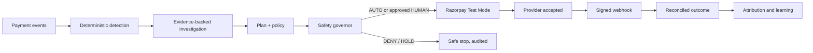

# Sentinel

**Evidence-led revenue recovery with deterministic financial authority.**

Sentinel detects payment failure clusters, investigates their causes, proposes bounded recovery actions, and executes only when persisted policy, human approval, governor, and provider-state gates allow it. AI can explain and propose; it can never authorize money movement.

| | Current release |
|---|---|
| Backend | Java 17 · Spring Boot 3.3 · PostgreSQL 16 · Flyway |
| Dashboard | Next.js · TypeScript · TanStack Query |
| Provider | Razorpay Test Mode only (`rzp_test_` keys) |
| Persistence | Append-only audit/evidence and idempotent financial state |
| Verification | 200 backend tests (0 failures, 1 credential-gated skip) · 55 dashboard tests |

Live review surfaces: [dashboard](https://sentinelxops.vercel.app), [Railway API](https://sentinel-production-0a0d.up.railway.app), [architecture](ARCHITECTURE.md), and [setup](SETUP.md).

## What Sentinel does

1. **Detect** — deterministic rules cluster failed payment events by rail, issuer, error, merchant, and time window, with quantified affected payments and amount at risk.
2. **Investigate** — bounded agents produce structured findings grounded in persisted evidence. Gemini is optional; a deterministic fallback keeps the workflow safe when it is unavailable.
3. **Plan and govern** — the planner proposes an allow-listed action. The deterministic policy engine returns `AUTO`, `HUMAN`, or `DENY`; the Recovery Safety Governor independently evaluates blast radius and exposure.
4. **Execute** — after all gates, Sentinel creates one idempotent Razorpay Test Mode Payment Link. Provider acceptance is not recovery.
5. **Reconcile and learn** — a signed Razorpay webhook is required before provider-confirmed recovery and financial attribution. Every transition is visible in the incident ledger and immutable audit trail.



## Truth boundaries

Sentinel keeps operational and analytical universes separate:

- **RAZORPAY TEST MODE** — owned test transactions and provider responses. Money is integer paise; no live keys are accepted.
- **SIMULATION / FAULT INJECTION** — deterministic demo incidents that exercise the real detection, policy, governor, and persistence pipeline.
- **HISTORICAL PUBLIC SOURCE** — 500 provenance-linked Razorpay public cases. They are replay-only and never invoke provider or customer tools; they are not private merchant transactions and carry no invented INR outcome.
- **SYNTHETIC BENCHMARK** — fixed-seed Recovery Olympics and Failure Lab evidence.
- **SHADOW ONLY / OBSERVATIONAL** — challenger policy/model comparisons with zero execution authority.
- **PROVIDER CONFIRMED** — shown only after a verified Razorpay event is reconciled. `PROVIDER ACCEPTED` and `AWAITING RECONCILIATION` are distinct states.

Models, shadow opportunities, historical replays, and counterfactual estimates never grant execution authority or change financial truth.

## Production demo workload

When enabled in the production profile, the backend idempotently seeds ten distinct Test Mode operational scenarios on startup/first workload request: UPI issuer degradation, gateway timeout, insufficient funds, payment declined, network error, API failure, bad request, rail degradation, risk review, and provider outage. Each incident owns its events, findings, plan, policy, governor, action, provider state, reconciliation, and audit trail. Refreshing the Recovery board calls the safe `ensure-workload` operation; it does not duplicate cases.

Manual Failure Lab injection uses a fresh namespace for every run. Existing failed or rejected actions remain terminal and are never rewritten into a fabricated recovery. A complete Test Mode journey is:

```text
reset → inject → investigate → plan → approve (when required)
→ governor → create Payment Link → customer completes Test Mode payment
→ signed payment_link.paid webhook → reconcile → RECOVERED / LEARN
```

## Dashboard

The live console is at [sentinelxops.vercel.app](https://sentinelxops.vercel.app). The main routes are:

- `/console` — command center with independent operational, historical, and evaluation panels.
- `/recovery` — selectable operational and historical portfolio with truth labels.
- `/cases` and `/incidents/[id]` — case explorer and governed Recovery Workbench, including evidence capsule, policy/governor state, execution ledger, reconciliation, and outcome.
- `/approvals` — persisted human-review queue with an honest empty state.
- `/control-tower` — health, exposure, governor posture, and attribution metrics.
- `/evaluation`, `/evaluation/recovery-olympics`, `/evaluation/historical` — fixed-seed benchmark and public-source replay evidence.
- `/demo` — Failure Lab scenarios, reset, and safe injection controls.

The browser receives sanitized DTOs only. Credentials, webhook secrets, raw provider bodies, customer contact data, and hidden model reasoning never reach the dashboard.

## API highlights

```text
GET  /actuator/health
GET  /actuator/info
GET  /api/v1/revenue/incidents
GET  /api/v1/revenue/incidents/{id}
POST /api/v1/revenue/incidents/{id}/investigate
POST /api/v1/revenue/incidents/{id}/plan
POST /api/v1/revenue/incidents/{id}/execute
POST /api/v1/revenue/actions/{id}/approve|reject|cancel
GET  /api/v1/revenue/approvals
GET  /api/v1/revenue/control-tower
GET  /api/v1/revenue/metrics
GET  /api/v1/revenue/financial-attribution
GET  /api/v1/revenue/lost-revenue
GET  /api/v1/revenue/incidents/{id}/audit-trail
GET  /api/v1/revenue/incidents/{id}/evidence-capsule
POST /api/v1/webhooks/razorpay
POST /api/v1/demo/reset
POST /api/v1/demo/ensure-workload
POST /api/v1/demo/inject/{scenario}
GET  /api/v1/diagnostics/llm
GET  /api/v1/evaluation/recovery-olympics
GET  /api/v1/evaluation/historical
```

The webhook validates the raw-body HMAC in constant time, persists the event ID before processing, acknowledges duplicates idempotently, and enqueues asynchronous recovery work. Provider errors are reduced to safe status/code/field/description data; raw response bodies and authorization headers are never logged or persisted.

## Configuration

Copy `.env.example` and supply values through a secret manager or local environment. Never commit an environment file.

| Variable | Default | Purpose |
|---|---|---|
| `SENTINEL_DB_URL` | — | PostgreSQL JDBC URL |
| `SENTINEL_DB_USERNAME` / `SENTINEL_DB_PASSWORD` | — | Database credentials |
| `RAZORPAY_ENABLED` | `false` | Enables Test Mode provider calls |
| `RAZORPAY_KEY_ID` | — | Must start with `rzp_test_` |
| `RAZORPAY_KEY_SECRET` | — | Read only by the provider adapter |
| `RAZORPAY_WEBHOOK_SECRET` | — | HMAC verification secret |
| `GEMINI_API_KEY` or `LLM_API_KEY` | — | Optional Gemini investigation key |
| `GEMINI_MODEL` | `gemini-3.5-flash` | Structured investigation model |
| `NEXT_PUBLIC_USE_FIXTURES` | `true` | Dashboard fixture/live switch |
| `NEXT_PUBLIC_SENTINEL_API_URL` | — | Backend base URL for the dashboard |

Production execution is deliberately disabled until Test Mode credentials, webhook configuration, and a safe callback/tunnel are verified. Setting `RAZORPAY_ENABLED=true` does not bypass policy, governor, idempotency, or reconciliation gates.

## Run locally

```bash
git clone https://github.com/sufibuildwith-py/Sentinel.git
cd Sentinel
docker compose up --build
```

The Compose stack starts PostgreSQL, applies Flyway V1–V23, starts the backend, and serves the dashboard on `http://localhost:3000`. See [SETUP.md](SETUP.md) for Test Mode webhook setup and the end-to-end walkthrough.

## Verification

Backend integration tests use real PostgreSQL 16 containers (not H2):

```bash
mvn clean verify
```

Dashboard checks:

```bash
cd dashboard
npm ci
npm run verify
npm run test:e2e
```

The credential-gated Razorpay smoke test is skipped when Test Mode secrets are absent. A skipped smoke test is not evidence of provider success. Browser tests distinguish fixture, live, historical, and shadow journeys.

## Safety and data handling

- All monetary values are `BIGINT` minor units; no floating-point financial calculations.
- Audit and evidence history is append-only. Demo reset soft-resets operational visibility while preserving audit/history records.
- Provider writes are idempotency-keyed and serialized; ambiguous responses enter reconciliation/uncertain handling rather than blind retry.
- Signed, at-least-once webhook delivery is deduplicated by external event ID and cannot reverse a confirmed paid outcome.
- Historical replay and shadow comparison are architecturally zero-tool paths.
- No secrets, raw webhook payloads, payment credentials, customer PII, or live-mode keys belong in Git, logs, prompts, responses, or evaluation artifacts.

## Further reading

- [ARCHITECTURE.md](ARCHITECTURE.md) — package boundaries, persistence, and state transitions.
- [SETUP.md](SETUP.md) — local setup, demo script, and webhook validation.
- [evaluation/README.md](evaluation/README.md) — reproducible benchmark methodology and limitations.
- [evaluation/razorpay-historical/README.md](evaluation/razorpay-historical/README.md) — historical corpus provenance and replay rules.
- [LICENSE](LICENSE) — repository usage terms.

## License

© 2026 Sufiyan Khan. All rights reserved. This repository is shared for review and evaluation, including Razorpay Buildathon judging. See [LICENSE](LICENSE) for the full notice.
